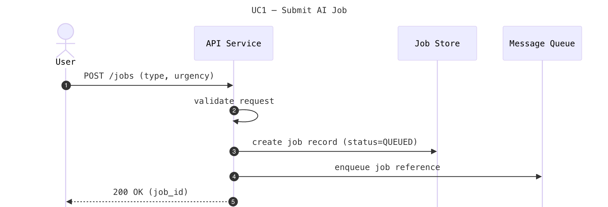
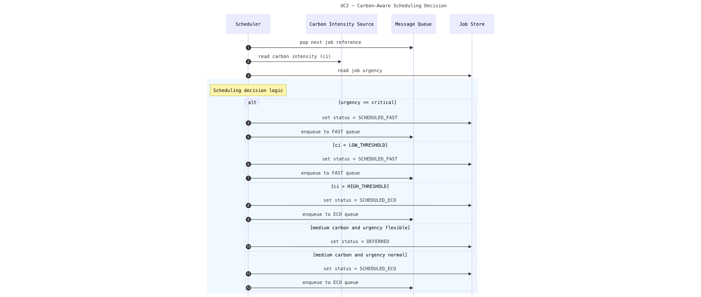
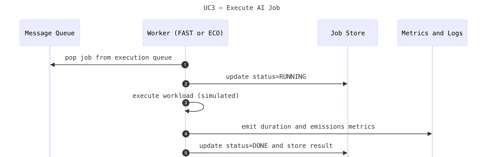
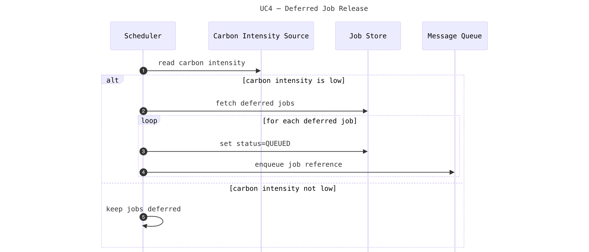
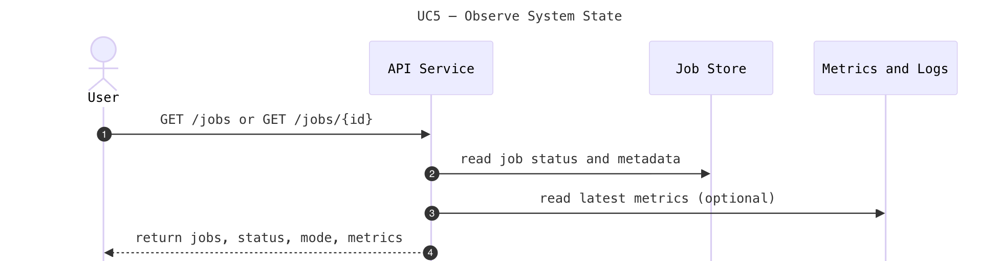
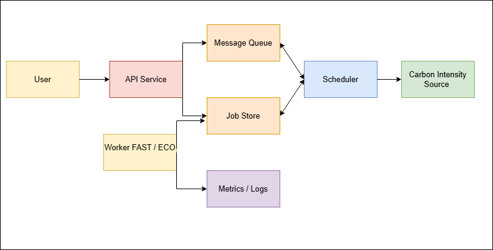
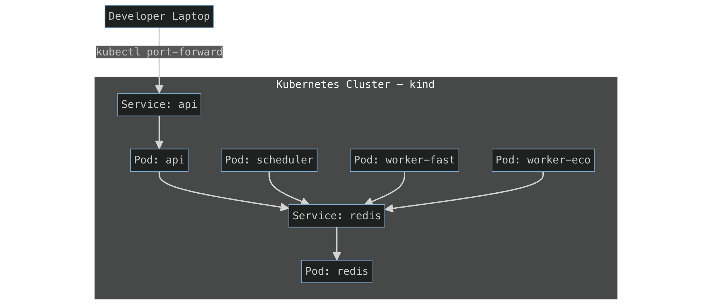

# Carbon-Aware AI Job Orchestrator

## Project Definition and Overall Description

This project implements a carbon-aware AI job orchestration application that automatically decides when, where, and how AI workloads are executed based on carbon intensity, job urgency, and simple service-level objectives (SLOs). The system targets realistic AI platform scenarios where many workloads—such as batch inference, analytics, and report generation—are operationally flexible and can be scheduled to reduce emissions without changing models or user workflows.

Users submit AI jobs through a simple API or UI, providing metadata such as job type and urgency. Jobs are placed onto a lightweight message queue to decouple components and enable scalable, fault-tolerant processing. A central Scheduler continuously reads a simulated carbon-intensity signal and applies a policy-based decision engine. When carbon intensity is low, jobs are executed immediately on a high-performance containerized worker. When carbon intensity is high, non-critical jobs are routed to an energy-efficient worker with lower resource usage. Under medium carbon conditions, flexible jobs may be deferred until greener execution windows are available. Critical jobs always override carbon-based deferral to ensure SLO compliance.

Workers execute a representative AI workload (simulated inference or analytics) and record execution outcomes such as duration and execution mode, as well as CO₂ emissions where feasible (e.g., using CodeCarbon). The system exposes job status and basic operational and sustainability metrics, allowing users to observe how carbon-aware decisions affect execution behaviour.

## Architecturally Significant Use Cases

### UC1 – Submit AI Job
Users submit AI jobs through the API service, providing metadata including job type and urgency level. This use case establishes the entry point for the system and demonstrates the decoupled architecture where job submission is independent of execution scheduling.

### UC2 – Carbon-Aware Scheduling Decision
The Scheduler continuously monitors carbon intensity signals and applies policy-based routing decisions. This use case is architecturally significant as it centralizes the carbon-aware decision logic, enabling flexible policy updates without modifying worker implementations.

### UC3 – Execute AI Job
Workers execute AI workloads based on assignments from the Scheduler. This use case demonstrates the separation between scheduling logic and execution, allowing different worker types (FAST/ECO) to be scaled independently based on carbon conditions.

### UC4 – Deferred Job Release
When carbon intensity is medium and jobs are flexible, the Scheduler defers execution until more favorable conditions. This use case illustrates the system's ability to balance operational requirements with sustainability objectives through intelligent job queuing.

### UC5 – Observe System State
Users and operators query job status, execution metrics, and carbon emissions data through the API. This use case demonstrates observability and the system's ability to provide transparency into carbon-aware decision-making and its impact on execution behavior.

## Diagrams

### Sequence Diagrams

#### UC1 – Submit AI Job


#### UC2 – Carbon-Aware Scheduling Decision


#### UC3 – Execute AI Job


#### UC4 – Deferred Job Release


#### UC5 – Observe System State


### Component Diagram


### Deployment Diagram


## System Components (Architectural Overview)

- **API Service**: REST API endpoint for job submission, status queries, and system metrics. Handles user requests and provides the primary interface to the orchestration system.

- **Scheduler**: Central decision engine that continuously monitors carbon intensity signals and applies routing policies. Determines when and where jobs should execute based on carbon conditions and job urgency.

- **Job Store**: Persistent storage for job metadata, execution history, and status information. Enables job tracking and observability across system restarts.

- **Message Queue**: Lightweight queue system for decoupling job submission from execution. Enables scalable, fault-tolerant processing and supports deferred job release.

- **Worker FAST**: High-performance containerized worker optimized for low-latency execution. Activated during low carbon intensity periods to minimize execution time.

- **Worker ECO**: Energy-efficient worker with lower resource usage. Activated during high carbon intensity periods for non-critical jobs to reduce emissions.

- **Carbon Intensity Source (simulated)**: Provides real-time carbon intensity signals to the Scheduler. In this checkpoint, uses simulated data to demonstrate the decision-making architecture.

- **Metrics and Logs**: System observability components that track execution duration, execution mode, carbon emissions, and operational metrics for analysis and reporting.

## Technology Stack

- **Python 3.11**: Core programming language for all services
- **FastAPI**: REST API framework for the API service
- **Redis**: Job store and message queue implementation
- **Docker**: Containerization platform for service packaging
- **Kubernetes (kind)**: Local Kubernetes cluster for orchestration and deployment
- **kubectl**: Command-line tool for Kubernetes cluster management

## Repository Structure

```
.
├── services/
│   ├── api/              # API service implementation
│   │   ├── main.py
│   │   ├── requirements.txt
│   │   └── Dockerfile
│   ├── scheduler/         # Scheduler service implementation
│   │   ├── main.py
│   │   ├── requirements.txt
│   │   └── Dockerfile
│   └── worker/           # Worker service implementation
│       ├── main.py
│       ├── requirements.txt
│       └── Dockerfile
├── k8s/                  # Kubernetes manifests
│   ├── redis.yaml
│   ├── api.yaml
│   ├── scheduler.yaml
│   ├── worker-fast.yaml
│   └── worker-eco.yaml
├── scripts/              # Deployment scripts
│   ├── deploy-kind.sh
│   ├── deploy-k8s.sh
│   └── port-forward.sh
├── docs/
│   └── diagrams/         # Architecture and sequence diagrams
│       ├── uc1-diagram.png
│       ├── uc2-diagram.png
│       ├── uc3-diagram.png
│       ├── uc4-diagram.png
│       ├── uc5-diagram.png
│       ├── component-diagram.png
│       └── deployment-diagram.png
├── docker-compose.yml
└── README.md
```

## Deployment (Local Kubernetes with kind)

To deploy the system locally using kind:

```bash
chmod +x scripts/*.sh
./scripts/deploy-kind.sh
kubectl get pods
./scripts/port-forward.sh
curl http://localhost:8000/health
```

The deployment script creates a kind cluster, builds Docker images for all services, loads them into the cluster, and applies Kubernetes manifests. This demonstrates a complete deployment workflow from source code to a running application in a Kubernetes environment. The port-forward command enables local access to the API service for testing and verification.
